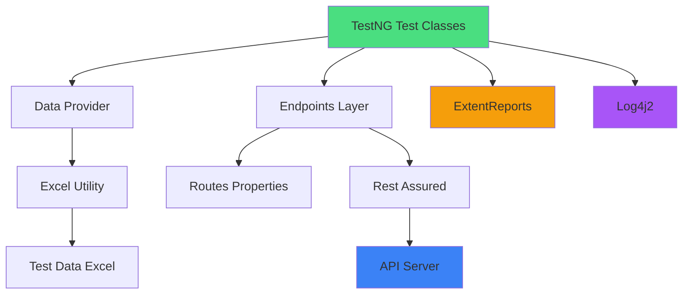

# 🚀 REST API Automation TestNG Framework

<div align="center">


### 🎯 Robust & Scalable REST API Testing Framework

*Enterprise-grade automation framework with data-driven testing, comprehensive reporting, and intelligent logging*

[Features](#-features) • [Quick Start](#-getting-started) • [Architecture](#-project-structure) • [Documentation](#-documentation)

---


</div>

---

## 📖 Overview

A **production-ready REST API automation testing framework** built with industry best practices. This framework leverages the power of Java, TestNG, and Rest Assured to deliver robust, maintainable, and scalable API test automation with Excel-based data-driven testing and rich HTML reporting.

Perfect for **QA Engineers**, **Test Automation Engineers**, and **Development Teams** looking to implement comprehensive API testing strategies.

---

## ✨ Features

<table>
<tr>
<td width="33%" valign="top">

### 🔁 **Data-Driven Testing**
- Excel-based test data management
- Apache POI integration
- Dynamic data providers
- Easy test data maintenance

</td>
<td width="33%" valign="top">

### 📊 **Rich Reporting**
- ExtentReports HTML dashboards
- Detailed test execution logs
- Screenshot attachments
- Pass/Fail statistics

</td>
<td width="33%" valign="top">

### 🔧 **Configuration Management**
- Properties-based endpoints
- Environment-specific configs
- Centralized settings
- Easy deployment

</td>
</tr>
<tr>
<td width="33%" valign="top">

### 🎯 **TestNG Integration**
- Parallel test execution
- Test suite management
- Flexible assertions
- Dependency handling

</td>
<td width="33%" valign="top">

### 📝 **Intelligent Logging**
- Log4j2 implementation
- Multiple log levels
- Rotating file appenders
- Debug-friendly output

</td>
<td width="33%" valign="top">

### 🏗️ **Modular Architecture**
- Page Object Model (POM)
- Reusable components
- SOLID principles
- Easy scalability

</td>
</tr>
</table>

---

## 🔧 Tech Stack & Tools

<div align="center">

| Technology | Purpose | Version |
|------------|---------|---------|
| ☕ **Java** | Programming Language | 21 |
| 📦 **Maven** | Build & Dependency Management | Latest |
| 🧪 **TestNG** | Test Runner & Assertions | Latest |
| 🌐 **Rest Assured** | REST API Testing | Latest |
| 📊 **Apache POI** | Excel Data Management | Latest |
| 📈 **ExtentReports** | HTML Test Reporting | Latest |
| 📝 **Log4j2** | Logging Framework | Latest |
| 🔀 **Git** | Version Control | Latest |

</div>

---

## 📁 Project Structure

```
PetStoreAutomation/
│
├── 📂 src/
│   └── 📂 test/
│       ├── 📂 java/
│       │   └── 📂 api/
│       │       ├── 📂 endpoints/        # REST endpoints & routes
│       │       │   ├── UserEndpoints.java
│       │       │   ├── StoreEndpoints.java
│       │       │   └── PetEndpoints.java
│       │       │
│       │       ├── 📂 payload/          # POJOs for request/response
│       │       │   ├── User.java
│       │       │   ├── Pet.java
│       │       │   └── Order.java
│       │       │
│       │       ├── 📂 test/             # TestNG test classes
│       │       │   ├── UserTests.java
│       │       │   ├── PetTests.java
│       │       │   └── DDTests.java
│       │       │
│       │       └── 📂 utilities/        # Helper classes
│       │           ├── DataProviders.java
│       │           ├── ExcelUtility.java
│       │           ├── ExtentReportManager.java
│       │           └── Endpoints.java
│       │
│       └── 📂 resources/
│           ├── log4j2.xml              # Logging configuration
│           └── routes.properties       # API endpoint URLs
│
├── 📂 testData/                        # Excel test data files
│   └── UserData.xlsx
│
├── 📂 reports/                         # Generated ExtentReports
│   └── Test-Report-{timestamp}.html
│
├── 📂 logs/                            # Application logs
│   └── automation.log
│
├── 📄 testng.xml                       # TestNG suite configuration
├── 📄 pom.xml                          # Maven dependencies & build
├── 📄 .gitignore                       # Git ignore rules
└── 📄 README.md                        # Project documentation
```

---

## 🎯 Framework Architecture



---

## 🚀 Getting Started

### 📋 Prerequisites

Before you begin, ensure you have the following installed:

| Requirement | Version | Installation |
|-------------|---------|--------------|
| ☕ **Java JDK** | 21+ | [Download](https://www.oracle.com/java/technologies/downloads/) |
| 📦 **Maven** | 3.8+ | [Download](https://maven.apache.org/download.cgi) |
| 💻 **IDE** | Any | IntelliJ IDEA / Eclipse / VS Code |
| 🔀 **Git** | Latest | [Download](https://git-scm.com/downloads) |

### ⚡ Installation

**Step 1️⃣: Clone the Repository**

```bash
git clone https://github.com/mvsaran/RestAPI-Automation-TestNG-Framework.git
cd RestAPI-Automation-TestNG-Framework
```

**Step 2️⃣: Install Dependencies**

```bash
mvn clean install
```

**Step 3️⃣: Verify Setup**

```bash
mvn test -Dtest=UserTests
```

---

## 🧪 Running Tests

### ▶️ Run All Tests

```bash
mvn clean test
```

### 🎯 Run Specific Test Suite

```bash
mvn test -DsuiteXmlFile=testng.xml
```

### 🔍 Run Specific Test Class

```bash
mvn test -Dtest=UserTests
```

### 🔀 Run Tests in Parallel

```bash
mvn test -Dparallel=methods -DthreadCount=4
```

### 📊 Run with Custom Report Name

```bash
mvn test -DreportName="API-Test-Report"
```

---

## 📊 Test Reports

### 📈 ExtentReports

After test execution, detailed HTML reports are generated in the `reports/` directory.

**Features:**
- ✅ Pass/Fail/Skip statistics
- 📸 Request/Response details
- ⏱️ Execution time tracking
- 🎨 Beautiful dashboard view
- 📋 Test case details with logs

**Viewing Reports:**

```bash
# Navigate to reports directory
cd reports/

# Open the latest report
open Test-Report-{timestamp}.html  # macOS
start Test-Report-{timestamp}.html # Windows
xdg-open Test-Report-{timestamp}.html # Linux
```

### 📝 Log Files

Detailed execution logs are available in `logs/automation.log`

**Log Levels:**
- 🔴 ERROR - Critical issues
- 🟠 WARN - Warning messages
- 🔵 INFO - General information
- 🟢 DEBUG - Detailed debugging info

---

## 📦 Maven Dependencies

<details>
<summary><b>Click to expand pom.xml dependencies</b></summary>

```xml
<dependencies>
    <!-- Rest Assured -->
    <dependency>
        <groupId>io.rest-assured</groupId>
        <artifactId>rest-assured</artifactId>
        <version>5.3.0</version>
    </dependency>
    
    <!-- TestNG -->
    <dependency>
        <groupId>org.testng</groupId>
        <artifactId>testng</artifactId>
        <version>7.8.0</version>
    </dependency>
    
    <!-- Apache POI for Excel -->
    <dependency>
        <groupId>org.apache.poi</groupId>
        <artifactId>poi-ooxml</artifactId>
        <version>5.2.3</version>
    </dependency>
    
    <!-- ExtentReports -->
    <dependency>
        <groupId>com.aventstack</groupId>
        <artifactId>extentreports</artifactId>
        <version>5.0.9</version>
    </dependency>
    
    <!-- Log4j2 -->
    <dependency>
        <groupId>org.apache.logging.log4j</groupId>
        <artifactId>log4j-core</artifactId>
        <version>2.20.0</version>
    </dependency>
    
    <!-- JSON Processing -->
    <dependency>
        <groupId>com.google.code.gson</groupId>
        <artifactId>gson</artifactId>
        <version>2.10.1</version>
    </dependency>
</dependencies>
```

</details>

---

## 🔐 Configuration

### 📄 routes.properties

Configure your API endpoints in `src/test/resources/routes.properties`:

```properties
# Base URL
base_url=https://petstore.swagger.io/v2

# User Module Endpoints
post_url=/user
get_url=/user/{username}
update_url=/user/{username}
delete_url=/user/{username}

# Store Module Endpoints
store_post_url=/store/order
store_get_url=/store/order/{orderId}

# Pet Module Endpoints
pet_post_url=/pet
pet_get_url=/pet/{petId}
pet_update_url=/pet/{petId}
```

### 🔧 log4j2.xml

Customize logging behavior in `src/test/resources/log4j2.xml`:

```xml
<?xml version="1.0" encoding="UTF-8"?>
<Configuration status="WARN">
    <Appenders>
        <Console name="Console" target="SYSTEM_OUT">
            <PatternLayout pattern="%d{HH:mm:ss.SSS} [%t] %-5level %logger{36} - %msg%n"/>
        </Console>
        <File name="File" fileName="logs/automation.log">
            <PatternLayout pattern="%d{yyyy-MM-dd HH:mm:ss} [%t] %-5level %logger{36} - %msg%n"/>
        </File>
    </Appenders>
    <Loggers>
        <Root level="info">
            <AppenderRef ref="Console"/>
            <AppenderRef ref="File"/>
        </Root>
    </Loggers>
</Configuration>
```

---

## 📚 Framework Components

### 🎯 Endpoints Layer

Handles all API endpoint logic with Rest Assured:

```java
public class UserEndpoints {
    
    public static Response createUser(User payload) {
        return given()
            .contentType(ContentType.JSON)
            .accept(ContentType.JSON)
            .body(payload)
        .when()
            .post(Routes.post_url);
    }
    
    public static Response getUser(String userName) {
        return given()
            .pathParam("username", userName)
        .when()
            .get(Routes.get_url);
    }
}
```

### 📦 Payload Classes (POJOs)

Define request/response structures:

```java
public class User {
    private int id;
    private String username;
    private String firstName;
    private String lastName;
    private String email;
    private String password;
    private String phone;
    
    // Getters and Setters
}
```

### 📊 Data Providers

Excel-based data-driven testing:

```java
@DataProvider(name = "UserData")
public Object[][] getAllData() throws IOException {
    String path = System.getProperty("user.dir") + "//testData//UserData.xlsx";
    XLUtility xl = new XLUtility(path);
    
    int rownum = xl.getRowCount("Sheet1");
    int colcount = xl.getCellCount("Sheet1", 1);
    
    Object[][] apidata = new Object[rownum][colcount];
    
    for (int i = 1; i <= rownum; i++) {
        for (int j = 0; j < colcount; j++) {
            apidata[i-1][j] = xl.getCellData("Sheet1", i, j);
        }
    }
    return apidata;
}
```

### 🧪 Test Classes

TestNG test implementation:

```java
public class UserTests {
    
    @Test(priority = 1, dataProvider = "UserData", dataProviderClass = DataProviders.class)
    public void testPostUser(String userID, String userName, String fname, String lname, 
                             String email, String pwd, String ph) {
        
        User userPayload = new User();
        userPayload.setId(Integer.parseInt(userID));
        userPayload.setUsername(userName);
        userPayload.setFirstName(fname);
        userPayload.setLastName(lname);
        userPayload.setEmail(email);
        userPayload.setPassword(pwd);
        userPayload.setPhone(ph);
        
        Response response = UserEndpoints.createUser(userPayload);
        Assert.assertEquals(response.getStatusCode(), 200);
        
        logger.info("User created successfully");
    }
}
```

---

## 🎨 Best Practices Implemented

<div align="center">

| Practice | Implementation |
|----------|----------------|
| 🏗️ **Separation of Concerns** | Endpoints, Payloads, Tests, Utilities separated |
| 📦 **DRY Principle** | Reusable methods and utilities |
| 🔒 **Encapsulation** | Private fields with getters/setters |
| 📋 **Documentation** | Comprehensive inline comments |
| 🧪 **Test Independence** | Each test can run standalone |
| 🔄 **Maintainability** | Properties-based configuration |
| 📊 **Reporting** | Detailed logs and HTML reports |
| 🎯 **Assertions** | Proper validation at each step |

</div>

---

## 🐛 Troubleshooting

<details>
<summary><b>Common Issues & Solutions</b></summary>

### Issue: Maven build fails

**Solution:**
```bash
mvn clean install -U
```

### Issue: Tests not executing

**Solution:**
- Verify `testng.xml` configuration
- Check if test classes are in correct package
- Ensure @Test annotations are present

### Issue: Excel file not found

**Solution:**
- Verify file path in DataProviders class
- Ensure Excel file is in `testData/` directory
- Check file name spelling

### Issue: Reports not generating

**Solution:**
- Check ExtentReports configuration
- Verify `reports/` directory exists
- Ensure proper file permissions

</details>

---

## 📈 Continuous Integration

### 🔄 GitHub Actions

<details>
<summary><b>Sample workflow configuration</b></summary>

```yaml
name: API Test Automation

on:
  push:
    branches: [ main, develop ]
  pull_request:
    branches: [ main ]
  schedule:
    - cron: '0 2 * * *'  # Daily at 2 AM

jobs:
  test:
    runs-on: ubuntu-latest
    
    steps:
    - uses: actions/checkout@v3
    
    - name: Set up JDK 21
      uses: actions/setup-java@v3
      with:
        java-version: '21'
        distribution: 'temurin'
    
    - name: Build with Maven
      run: mvn clean install -DskipTests
    
    - name: Run Tests
      run: mvn test
    
    - name: Upload Test Reports
      uses: actions/upload-artifact@v3
      if: always()
      with:
        name: test-reports
        path: reports/
```

</details>

---

## 🤝 Contributing

Contributions are always welcome! Here's how you can help:

1. 🍴 **Fork** the repository
2. 🌿 **Create** your feature branch (`git checkout -b feature/AmazingFeature`)
3. ✨ **Commit** your changes (`git commit -m 'Add some AmazingFeature'`)
4. 📤 **Push** to the branch (`git push origin feature/AmazingFeature`)
5. 🎉 **Open** a Pull Request

### 📝 Contribution Guidelines

- Write clear commit messages
- Follow existing code style
- Add tests for new features
- Update documentation as needed
- Ensure all tests pass before submitting PR

---

## 📞 Support & Contact

<div align="center">

| Channel | Link |
|---------|------|
| 🐛 **Report Bug** | [Create Issue](https://github.com/mvsaran/RestAPI-Automation-TestNG-Framework/issues) |
| 💡 **Request Feature** | [Create Issue](https://github.com/mvsaran/RestAPI-Automation-TestNG-Framework/issues) |
| 📧 **Email** | your.email@example.com |
| 💼 **LinkedIn** | [Your Profile](https://linkedin.com/in/yourprofile) |

</div>

---

## 📄 License

This project is licensed under the **MIT License** - see the [LICENSE](LICENSE) file for details.

```
MIT License

Copyright (c) 2025 REST API Automation Framework

Permission is hereby granted, free of charge, to any person obtaining a copy
of this software and associated documentation files (the "Software"), to deal
in the Software without restriction...
```

---

## 🙏 Acknowledgments

- 🌐 **Rest Assured** - For making API testing simple and elegant
- 🧪 **TestNG** - For powerful test management capabilities
- 📊 **Apache POI** - For seamless Excel integration
- 📈 **ExtentReports** - For beautiful test reports
- 📝 **Log4j2** - For robust logging framework
- 👥 **Open Source Community** - For continuous inspiration

---

## 📊 Project Statistics

<div align="center">


</div>

---

## 🗺️ Roadmap

- [ ] 🔄 Add support for GraphQL APIs
- [ ] 🔐 Implement OAuth 2.0 authentication
- [ ] 🐳 Docker containerization
- [ ] ☁️ Cloud deployment support (AWS/Azure)
- [ ] 📱 Add API performance testing
- [ ] 🤖 AI-powered test generation
- [ ] 📊 Advanced analytics dashboard
- [ ] 🔗 Swagger integration

---

<div align="center">

### ⭐ If you find this project helpful, please give it a star!

**Made with ❤️ by Test Automation Engineers**

[⬆ Back to Top](#-rest-api-automation-testng-framework)

---

*Happy Testing! 🚀*

</div>
